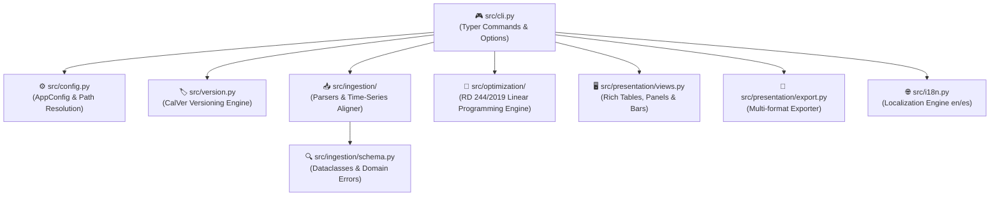

# 🤖 AGENTS.md — Autonomous AI Agent Guide

Welcome to **Electricity Share Distributor** (`esd`). This document serves as the operational manual, domain reference, and architectural blueprint for autonomous AI agents collaborating on this codebase.

---

## 1. 🎯 Project Overview & Mission

`electricity-share-distributor` (`esd`) is a high-performance Python CLI utility designed to determine optimal electricity distribution coefficients ($\beta_i$) for collective photovoltaic installations (*autoconsumo colectivo*) in Spain under **Real Decreto 244/2019**.

It is a sibling utility to [`datadis-analyzer`](https://github.com/marcosDLCS/datadis-analyzer).

### Core Capabilities:
- **📥 Dual Time-Series Ingestion:** Ingests DATADIS hourly consumption CSVs per CUPS and Huawei FusionSolar PV generation Excel reports.
- **⏱️ Time-Series Alignment & Normalization:** Aligns disparate timestamps, accounting for daylight saving time (DST) transitions, missing intervals, and Spanish electricity meter conventions.
- **🧮 Optimal $\beta_i$ Allocation Engine:** Formulates and solves linear programming (LP) models to find monthly distribution coefficients ($\sum \beta_i \le 1.0$ or $100\%$) that maximize collective self-consumption and minimize unused solar surplus spilled to the grid.
- **📊 Rich Terminal UI:** Renders clear tabular views, summary metrics, and visual share bars formatted for 80-column terminals.
- **📝 Multi-Format Reporting:** Generates timestamped export reports in Markdown, CSV, and JSON into `.output/`.
- **⚙️ Persistent Configuration:** Maintains language preferences (`en`/`es`) and directory paths in `.esd_config.json`.

---

## 2. 🧩 Architecture & Component Boundaries



### File Hierarchy
```text
electricity-share-distributor/
├── pyproject.toml              # Build config, CLI entry point (esd), Ruff & Pytest config
├── requirements.txt            # Dependency manifest
├── LICENSE                     # MIT License
├── README.md / AGENTS.md       # User guide and agent directives
├── CONTRIBUTING.md             # Contribution guidelines & Conventional Commits
├── .pre-commit-config.yaml     # Git hook definitions (Ruff linter, formatter, CalVer)
├── .esd_config.json            # Persistent application configuration
├── .input/                     # Raw input data
│   ├── consumption/            # DATADIS hourly consumption CSV files
│   └── generation/             # Huawei FusionSolar generation Excel files
├── .output/                    # Generated reports and exports
├── src/
│   ├── cli.py                  # Typer CLI application and command dispatch
│   ├── config.py / i18n.py     # Configuration, path resolution, and translations
│   ├── version.py              # CalVer version management and pre-commit enforcer
│   ├── ingestion/              # Parsers, schemas, and time-series alignment
│   ├── optimization/           # Regulatory allocation model & solver engine
│   └── presentation/           # Rich console UI, views, and exporters
└── tests/                      # Automated unit, integration, and CLI test suite
```

---

## 3. 🛠️ Technology Stack & Standards

| Component | Technology | Standard / Role |
| :--- | :--- | :--- |
| **Runtime** | Python 3.11+ | Modern typing, union types (`X \| Y`), dataclasses |
| **CLI & UI** | Typer & Rich | Command parsing, 80-column tables, visual bars |
| **Data Engine** | Pandas & Openpyxl | Time-series indexing, CSV and Excel ingestion |
| **Optimization** | Scipy (`scipy.optimize.linprog`) | Linear programming solver for optimal $\beta$ coefficients |
| **Versioning** | CalVer (`YYYY.MM.NNN`) | Automated per-commit version increments |
| **Quality** | Ruff & Pre-commit | Linter, code formatter, git hook enforcement |
| **Testing** | Pytest | Unit and integration test coverage |

---

## 4. 📐 Domain Invariants & Regulatory Framework

1. **Real Decreto 244/2019 (Autoconsumo Colectivo):**
   - Participating CUPS receive a fraction $\beta_i$ of solar PV generation in each hour $h$.
   - Coefficient constraint: $0 \le \beta_i \le 1$ and $\sum_i \beta_i \le 1.0$ (or $100.00\%$).
   - Monthly coefficients $\beta_{i, m}$ remain fixed throughout month $m$.
2. **Hourly Self-Consumption & Residual Balance:**
   - Allocated Generation: $G_{i, h} = \beta_i \cdot G_h$
   - Self-Consumed Energy: $SC_{i, h} = \min(C_{i, h}, \beta_i \cdot G_h)$
   - Residual Grid Demand: $RD_{i, h} = \max(0, C_{i, h} - \beta_i \cdot G_h)$
   - Surplus / Excess Generation: $Surplus_{i, h} = \max(0, \beta_i \cdot G_h - C_{i, h})$
3. **Collective Optimization Objective:**
   $$\max_{\beta} \sum_{i} \sum_{h \in m} \min(C_{i, h}, \beta_i \cdot G_h) \quad \text{s.t.} \quad \sum_i \beta_i \le 1, \; \beta_i \ge 0$$
4. **DATADIS Time Series:**
   - Hours 01:00–24:00 (hour 01:00 = interval 00:00–01:00).
   - Values are hourly kWh consumption per CUPS.
5. **Huawei FusionSolar Generation:**
   - Timestamps `YYYY-MM-DD HH:MM:SS`. Column `Rendimiento FV (kWh)` or `Rendimiento del inversor (kWh)`.

---

## 5. 🤖 Directives for Autonomous AI Agents

- **🛡️ Directive 1: Anonymization & Data Privacy is Absolute.** Universal Supply Point Codes (CUPS) are legally protected residential identifiers under European GDPR (Regulation EU 2016/679) and Spanish Organic Law 3/2018 (LOPDGDD).
  - **Zero Real Data Policy:** Never commit, log, or include real DATADIS CUPS, contract numbers, residential addresses, customer names, or real customer consumption datasets in the codebase, tests, documentation, or commit messages.
  - **Synthetic Mock Specification:** Exclusively use authorized synthetic mock identifiers adhering strictly to pattern `ES00210000000000XXYY` (e.g., `ES0021000000000001AA`, `ES0021000000000002BB`, etc.).
  - **Automated Verification Harness:** Enforce zero-leakage via the security harness:
    ```bash
    python3 -m src.security            # Scans workspace files and entire git commit history
    python3 -m src.security --history  # Explicit git history scan across all commit blobs and messages
    pre-commit run privacy-cups-checker # Pre-commit hook enforcement
    ```
  - **Git History Invariant:** No commit containing real CUPS or private data may ever exist in Github history. If real data is ever detected in local commits before pushing, you must amend or rewrite commits prior to sharing.
- **🌐 Directive 2: Universal English Codebase.** Write all code, comments, docstrings, test names, CLI messages, and commit messages entirely in **English**.
- **🎯 Directive 3: Strict Modern Typing.** Use strict type hints (`typing`, native union syntax `X | Y`) on all function signatures, dataclasses, and class methods. Avoid bare `Any`.
- **🚨 Directive 4: Domain Exceptions.** Use custom domain exceptions (`EsdError`, `IngestionError`, `OptimizationError`). Handle errors gracefully without uncaught stack traces.
- **🖥️ Directive 5: The 80-Column Terminal Rule.** Rich tables must render cleanly on standard **80-column terminals**. Set `no_wrap=True` on numeric, percentage, and CUPS columns.
- **🧪 Directive 6: Test Completeness.** Any new calculation logic, CLI flag, or parser must include automated unit tests in `tests/`. Always run `pytest` before finalizing tasks.
- **🧹 Directive 7: Ruff & Pre-Commit Adherence.** Run `ruff check --fix .` and `ruff format .` before committing changes.
- **📝 Directive 8: Conventional Commits.** Adhere strictly to Conventional Commits (`feat:`, `fix:`, `chore:`, etc.).
- **🏷️ Directive 9: CalVer Increments on Every Commit.** Every commit must increment the CalVer sequence (`python -m src.version bump`).
