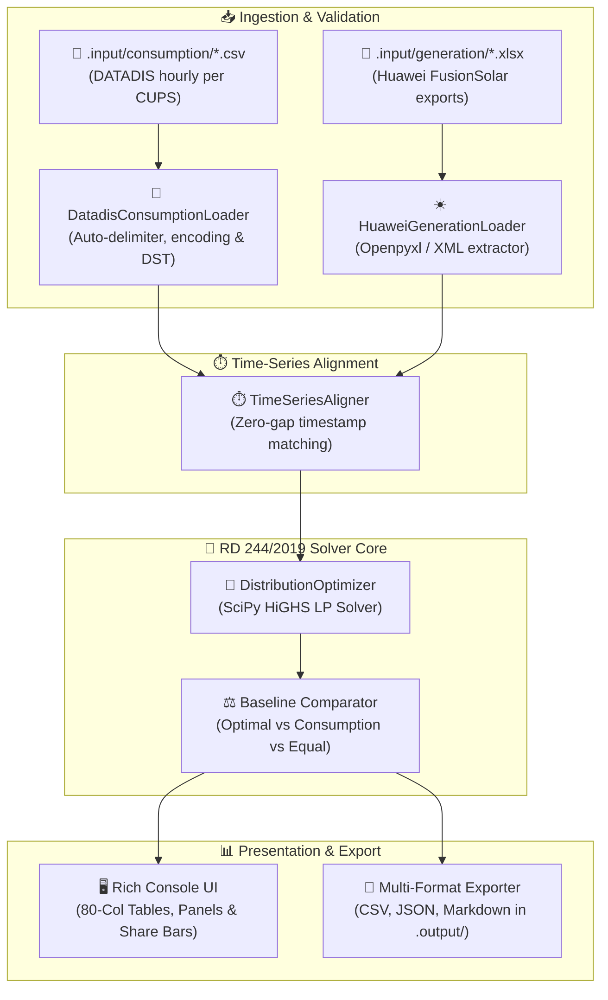

# ☀️ Electricity Share Distributor (`esd`)

> Optimal electricity distribution coefficients ($\beta_i$) for collective photovoltaic self-consumption (*autoconsumo colectivo*) in Spain under **Real Decreto 244/2019**.

[](https://www.python.org/)
[](pyproject.toml)
[](https://typer.tiangolo.com/)
[](https://rich.readthedocs.io/)
[](https://scipy.org/)
[](https://astral.sh/ruff)
[](https://pre-commit.com/)
[](LICENSE)

`electricity-share-distributor` (`esd`) is a high-performance Python CLI utility designed to determine optimal electricity distribution coefficients ($\beta_i$) for collective photovoltaic installations (*autoconsumo colectivo*) in Spain.

It is a sibling utility to [`datadis-analyzer`](https://github.com/marcosDLCS/datadis-analyzer).

📚 **Guides & Documentation:**
- [🇬🇧 Technical & Operational Guide (English)](docs/GUIDE_EN.md)
- [🇪🇸 Guía Técnica y de Funcionamiento (Español)](docs/GUIDE_ES.md)

---

## 🚀 Key Capabilities

- **📥 Dual Time-Series Ingestion:** Ingests hourly consumption curves from DATADIS CSV exports (per CUPS) and photovoltaic generation curves from Huawei FusionSolar Excel workbooks (`.xlsx`).
- **⏱️ Robust Time-Series Synchronization:** Automatic alignment across differing timestamp conventions, leap years, missing intervals, and European Daylight Saving Time (DST) switches (23-hour March spring transition, 25-hour October autumn transition).
- **🧮 Regulatory Optimization Engine:** Solves monthly linear programming (LP) models under **Real Decreto 244/2019** using `scipy.optimize.linprog(method='highs')`, finding optimal $\beta_i$ coefficients ($\sum \beta_i \le 1.0$ or $100.00\%$) that maximize collective self-consumption and minimize spilled solar surplus.
- **📋 Consolidated Distribution Share Matrix:** Computes and formats monthly shares per CUPS into an official schedule grid (CUPS on Y, Months on X) summing strictly to $\le 100\%$ with configured precision (0, 1, or 2 decimals) using Hare-Niemeyer exact remainder rounding.
- **⚖️ Multi-Strategy Efficiency Benchmarking:** Benchmarks optimal coefficients against standard baselines:
  - `optimal`: Linear programming maximizing collective self-consumption.
  - `consumption_share`: Proportional to each CUPS's share of total community demand.
  - `equal`: Uniform allocation split across all participating supply points ($1/N$).
- **📊 Rich 80-Column Terminal UI:** Elegant console rendering formatted strictly for 80-column terminals, complete with metric overview cards, monthly trajectory balances, strategy comparisons, and Unicode share bars (`████░░░░`).
- **📝 Multi-Format Reporting:** Generates timestamped export reports in CSV (ready for utility/distributor submission), structured JSON, and executive Markdown into `.output/`.
- **🏷️ Automated CalVer Versioning:** Increments release version on every commit following `YYYY.MM.NNN` (e.g., `2026.10.004`), displayed in console banners and reports.
- **🌐 Dual-Language Support:** Full English (`en`) and Spanish (`es`) localization, persisted across commands via `.esd_config.json`.

---

## 📐 Regulatory Framework (Real Decreto 244/2019)

In Spanish shared self-consumption schemes (*autoconsumo colectivo*), participating supplies receive a fixed fraction $\beta_i$ of hourly PV generation $G_h$ throughout each billing month:

1. **Coefficient Constraint:**
   $$0 \le \beta_i \le 1 \quad \text{and} \quad \sum_{i=1}^{N} \beta_i \le 1.0000 \; (100.00\%)$$

2. **Hourly Energy Balance per Supply Point (CUPS $i$ in hour $h$):**
   - **Allocated Solar Generation:** $G_{i, h} = \beta_i \cdot G_h$
   - **Self-Consumed Energy:** $SC_{i, h} = \min(C_{i, h}, \beta_i \cdot G_h)$
   - **Residual Grid Demand:** $RD_{i, h} = \max(0, C_{i, h} - \beta_i \cdot G_h)$
   - **Surplus Energy Spilled:** $Surplus_{i, h} = \max(0, \beta_i \cdot G_h - C_{i, h})$

3. **Collective Optimization Problem:**
   $$\max_{\beta_1, \dots, \beta_N} \sum_{i=1}^{N} \sum_{h \in \text{month}} \min(C_{i, h}, \beta_i \cdot G_h) \quad \text{s.t.} \quad \sum_{i=1}^{N} \beta_i \le 1, \; \beta_i \ge 0$$

   This piecewise-linear optimization is cast as a standard Linear Program and solved in milliseconds via SciPy's Simplex/HiGHS solver.

---

## 🏗️ Architecture & Data Flow



---

## 🖥️ Terminal Output Preview

```text
╭────────────── ⚡ COLLECTIVE SELF-CONSUMPTION COMMUNITY SUMMARY ──────────────╮
│                                                                              │
│  Supply Points (CUPS)     Total PV Generation      Total Community Demand    │
│  9 CUPS                   17,979.40 kWh            7,661.80 kWh              │
│  Date Range               Total Self-Consumed      Total Solar Surplus       │
│  2026-05-01 ➔ 2026-05-31  1,998.61 kWh (11.1%)     15,980.79 kWh             │
│                                                                              │
╰──────────────────────────────────────────────────────────────────────────────╯

              📈 Month-by-Month Community Energy Trajectory (kWh)
╭─────────┬───────────┬───────────┬───────────┬───────────┬─────────┬─────────╮
│ Month   │ Solar (k… │ Demand (… │ Self-Con… │ Surplus … │ Self-C… │ Covera… │
├─────────┼───────────┼───────────┼───────────┼───────────┼─────────┼─────────┤
│ 2026-05 │  17,979.4 │   7,661.8 │   1,998.6 │  15,980.8 │   11.1% │   26.1% │
├─────────┼───────────┼───────────┼───────────┼───────────┼─────────┼─────────┤
│ Total   │  17,979.4 │   7,661.8 │   1,998.6 │  15,980.8 │   11.1% │   26.1% │
╰─────────┴───────────┴───────────┴───────────┴───────────┴─────────┴─────────╯

               ⚖️ Allocation Strategy Efficiency Comparison (kWh)
╭────────────────────────┬───────────┬──────────┬─────────┬────────────────────╮
│ Strategy               │ Self-Con… │ Surplus… │ Self-C… │     Self-Cons Gain │
├────────────────────────┼───────────┼──────────┼─────────┼────────────────────┤
│ ★ Optimal (RD 244/201… │   1,998.6 │ 15,980.8 │   11.1% │    +240.7 (+13.7%) │
│   consumption_share    │   1,993.3 │ 15,986.1 │   11.1% │    +235.4 (+13.4%) │
│   equal                │   1,758.0 │ 16,221.4 │    9.8% │           Baseline │
╰────────────────────────┴───────────┴──────────┴─────────┴────────────────────╯

               📅 Suggested Electricity Distribution Share Matrix (β_i %)
    Regulatory allocation schedule (RD 244/2019) • Sum per month: 100%
╭──────────────────────┬─────────┬─────────┬─────────┬─────────┬────────────╮
│ CUPS                 │ 2025-12 │ 2026-01 │ 2026-02 │ 2026-03 │ Annual Avg │
├──────────────────────┼─────────┼─────────┼─────────┼─────────┼────────────┤
│ ES0021000000000001AA │   45.2% │   48.1% │   52.0% │   50.3% │      48.9% │
│ ES0021000000000002BB │   30.8% │   28.5% │   25.0% │   27.2% │      27.9% │
│ ES0021000000000003CC │   24.0% │   23.4% │   23.0% │   22.5% │      23.2% │
├──────────────────────┼─────────┼─────────┼─────────┼─────────┼────────────┤
│ TOTAL (RD 244/2019)  │  100.0% │  100.0% │  100.0% │  100.0% │     100.0% │
╰──────────────────────┴─────────┴─────────┴─────────┴─────────┴────────────╯
```

---

## ⚡ Quick Start

### 1. Installation

Clone the repository and install dependencies in an isolated virtual environment:

```bash
git clone https://github.com/marcosDLCS/electricity-share-distributor.git
cd electricity-share-distributor

python3 -m venv .venv
source .venv/bin/activate

pip install -e ".[dev]"
```

### 2. Initialize Project Directories

Create the necessary `.input/` and `.output/` directories and default configuration:

```bash
esd init
# Or initialize in Spanish:
esd init --lang es
```

### 3. Place Input Files

- Put DATADIS hourly CSV files into `.input/consumption/` (one file per CUPS, or bulk exports).
- Put Huawei FusionSolar `.xlsx` generation reports into `.input/generation/`.

### 4. Run Optimization

```bash
# Calculate optimal coefficients for all available data
esd calculate

# Focus on a specific month and export all reports (CSV, JSON, Markdown)
esd calculate -y 2026 -m 5 -f all

# Inspect comparison between LP optimization and equal allocation
esd calculate -v comparison
```

---

## 📖 CLI Command Reference

### `esd calculate`
Calculates optimal monthly distribution coefficients ($\beta_i$).

```bash
esd calculate [OPTIONS]
```

| Option | Flag | Description | Default |
| :--- | :--- | :--- | :--- |
| `--strategy` | `-s` | Allocation method: `optimal`, `consumption_share`, or `equal` | `optimal` |
| `--year` | `-y` | Filter calculation to a specific calendar year | `None` (all) |
| `--month` | `-m` | Filter calculation to a specific month (1–12) | `None` (all) |
| `--view` | `-v` | Terminal view mode: `summary` (overview + matrix + details), `matrix` (share matrix), `trajectory`, `coefficients`, `comparison`, or `all` | `summary` |
| `--format` | `-f` | Report export format: `all`, `csv`, `json`, `markdown`, `table` / `none` | `all` |
| `--output-dir` | `-o` | Custom report destination directory | `.output` |
| `--lang` | `-l` | Language override (`en` or `es`) | From config |

### `esd doctor`
Audits input data files to detect gaps, missing hourly intervals, inactive meters, and temporal alignment issues:

```bash
esd doctor
# With detailed missing timestamps list:
esd doctor --verbose
```

| Option | Flag | Description | Default |
| :--- | :--- | :--- | :--- |
| `--consumption-dir` | `-c` | Folder containing DATADIS hourly consumption CSVs | `.input/consumption` |
| `--generation-dir` | `-g` | Folder containing Huawei FusionSolar generation Excel files | `.input/generation` |
| `--verbose` | `-v` | Show complete list of all detected missing intervals | `False` |
| `--lang` | `-l` | Language override (`en` or `es`) | From config |

### `esd init`
Sets up project directory hierarchy (`.input/consumption`, `.input/generation`, `.output`) and default `.esd_config.json`. Defaults to English (`en`) and zero precision (`0`).

```bash
esd init [--lang en|es] [--precision 0|1|2]
```

### `esd config`
Inspects or modifies persistent configuration:

```bash
# View active configuration
esd config

# Set default application language to Spanish
esd config --lang es

# Update default data directories
esd config --consumption-dir /path/to/consumption --generation-dir /path/to/generation
```

### `esd cleanup`
Removes generated reports and export files from `.output/`:

```bash
esd cleanup
esd cleanup --force  # Skip interactive confirmation
```

### `esd version`
Displays active CalVer release version and build metadata:

```bash
esd version
```

---

## 📁 File Structure & Input Data Specifications

```text
electricity-share-distributor/
├── pyproject.toml              # Build config, CLI entry point (esd), Ruff & Pytest config
├── requirements.txt            # Dependency manifest
├── LICENSE                     # MIT License
├── README.md / AGENTS.md       # User documentation & Agent directives
├── CONTRIBUTING.md             # Contribution guidelines & Conventional Commits
├── docs/                       # Comprehensive documentation guides
│   ├── GUIDE_EN.md             # Technical & operational guide (English)
│   └── GUIDE_ES.md             # Technical & operational guide (Spanish)
├── .pre-commit-config.yaml     # Git hook definitions (Ruff linter, formatter, CalVer)
├── .esd_config.json            # Persistent application configuration
├── .input/                     # Raw input data
│   ├── consumption/            # DATADIS hourly consumption CSV files
│   └── generation/             # Huawei FusionSolar generation Excel files
├── .output/                    # Generated reports and exports
│   ├── YYYYMMDD_HHMMSS_esd_coefficients_matrix.csv
│   ├── YYYYMMDD_HHMMSS_esd_coefficients.csv
│   ├── YYYYMMDD_HHMMSS_esd_results.json
│   └── YYYYMMDD_HHMMSS_esd_optimization_summary.md
└── src/
    ├── cli.py                  # Typer CLI application and command dispatch
    ├── config.py / i18n.py     # Configuration, path resolution, and translations
    ├── version.py              # CalVer version management and pre-commit enforcer
    ├── ingestion/              # Ingestion loaders, schemas, and time-series alignment
    ├── optimization/           # RD 244/2019 Linear Programming allocation engine
    └── presentation/           # Rich console UI, views, and multi-format exporters
```

### Supported Ingestion Formats

1. **DATADIS Consumption Files (`.csv`):**
   - Automatically detects semicolon (`;`), comma (`,`), or tab delimiters.
   - Handles European comma (`0,152`) and standard dot (`0.152`) decimals.
   - Detects UTF-8, UTF-8-SIG, and Latin-1 character encodings.
   - Maps Spanish 01:00–24:00 billing hours and standard Daylight Saving Time shifts.

2. **Huawei FusionSolar Generation Files (`.xlsx`):**
   - Ingests inverter and plant generation export reports.
   - Parses date-time columns with `DST` labels.
   - Extracts PV generation yield (`Rendimiento FV (kWh)` or `Rendimiento del inversor (kWh)`).

---

## 🧪 Testing & Code Quality

The codebase enforces strict type safety, 100% English naming, and comprehensive test coverage across all modules.

```bash
# Run complete automated test suite
pytest -v

# Run linter and formatter checks
ruff check .
ruff format --check .

# Run pre-commit hooks manually
pre-commit run --all-files
```

---

## 🔒 Security & Data Privacy Notice

Under Spain's regulatory framework and European GDPR (Regulation EU 2016/679, along with Spanish Organic Law 3/2018 LOPDGDD), Universal Supply Point Codes (**CUPS**) and granular consumption time-series are confidential personal data.

- **Synthetic Identifiers:** All documentation examples, sample reports, and test cases use synthetic mock identifiers adhering strictly to `ES00210000000000XXYY` (`ES0021000000000001AA`, `ES0021000000000002BB`, etc.).
- **Local Data Isolation:** Input folders (`.input/`) and generated reports (`.output/`) are excluded from Git tracking via `.gitignore`.
- **Automated Verification Harness:** A pre-commit hook and automated CI harness execute `python3 -m src.security` to audit workspace files and the entire Git commit history, guaranteeing that no real CUPS or residential identifiers ever enter version control.
  ```bash
  python3 -m src.security         # Verify workspace and all commit history
  python3 -m src.security --staged # Verify staged git index changes
  ```

---

## 🤝 Contributing

Contributions are welcome! Please read [CONTRIBUTING.md](CONTRIBUTING.md) for details on our code of conduct, development setup, and the Conventional Commits specification.

---

## 📄 License

This project is licensed under the **MIT License** — see the [LICENSE](LICENSE) file for details.
