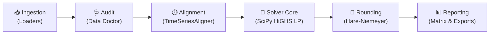

# 📘 Comprehensive Technical & Operational Guide (`esd`)

> **Target Audience:** Developers, data engineers, and energy consultants who have technical proficiency but are not necessarily domain specialists in Spanish electricity regulatory frameworks or linear programming.

---

> [!IMPORTANT]
> ### 🛡️ Maintenance & Synchronization Harness
> **To all engineers, developers, and autonomous AI agents:**
> This document is the primary conceptual and operational blueprint for `electricity-share-distributor`.
> Whenever modifying the data ingestion schemas ([`src/ingestion/`](file:///Users/marcos/workspace/repo/electricity-share-distributor/src/ingestion)), linear programming solver models ([`src/optimization/`](file:///Users/marcos/workspace/repo/electricity-share-distributor/src/optimization)), terminal presentation tables ([`src/presentation/views.py`](file:///Users/marcos/workspace/repo/electricity-share-distributor/src/presentation/views.py)), or file exporters ([`src/presentation/export.py`](file:///Users/marcos/workspace/repo/electricity-share-distributor/src/presentation/export.py)), you **MUST** update this guide (`GUIDE_EN.md`) and its Spanish sibling (`GUIDE_ES.md`) to maintain strict architectural alignment.

---

## 1. 🎯 Foundational Principles & Regulatory Context

### The Challenge of Collective Self-Consumption
In Spain, **Real Decreto 244/2019** regulates collective self-consumption (*autoconsumo colectivo*). In this setup, several residential or commercial units (each identified by a unique Universal Supply Point Code, or **CUPS**) share electricity generated by a single common photovoltaic (PV) solar installation.

The law requires participants to agree on how the hourly solar generation is divided among them:
1. **Hourly Distribution Coefficients ($\beta_i$):** In every hour $h$, participant $i$ receives a portion of generation equal to $\beta_i \cdot G_h$.
2. **Monthly Static Constraint:** The regulation allows coefficients to differ across calendar months ($\beta_{i, m}$), but **within any single calendar month, each participant's share $\beta_i$ remains strictly fixed for all hours**.
3. **Budget Constraint:** The sum of shares across all participants in any month cannot exceed 100%:
   $$\sum_{i=1}^{N} \beta_{i, m} \le 1.0000 \quad (100.00\%)$$

### Why Naive Splits Waste Energy
A simple equal split ($\beta_i = 1/N$, e.g., $11.1\%$ for 9 neighbors) or a flat demand-based share often results in massive energy waste:
- **Diurnal Solar Curve:** Solar generation occurs strictly during daytime hours (typically 08:00 to 20:00).
- **Mismatch of Habits:** If a participant works away from home during the day, or has a dormant vacation home, their assigned solar kWh are unused and "spilled" to the grid. In Spain, grid feed-in compensation (*compensación de excedentes*) is paid at wholesale pool rates—far lower than retail electricity prices.
- **The Optimization Goal:** `esd` solves for monthly coefficients ($\beta_{i, m}$) that **maximize collective self-consumption** $\sum_i \min(C_{i, h}, \beta_{i, m} \cdot G_h)$ across the community, keeping energy inside the collective and minimizing grid dependency.

---

## 2. 📥 How `esd` Ingests Information

`esd` operates on two complementary time-series inputs placed in the `.input/` directory:

```
.input/
├── consumption/    # DATADIS hourly consumption CSVs (one or more files per CUPS)
└── generation/     # Huawei FusionSolar generation Excel workbooks (.xlsx)
```

### 1. DATADIS Hourly Consumption Curves
- **Source:** [DATADIS](https://datadis.es), the official unified platform of Spanish electricity distribution system operators (DSOs).
- **Format:** CSV files with columns `CUPS`, `Fecha` (`YYYY/MM/DD` or `DD/MM/YYYY`), `Hora` (1 to 24), and `Consumo_kWh`.
- **Handling in Code ([`DatadisConsumptionLoader`](file:///Users/marcos/workspace/repo/electricity-share-distributor/src/ingestion/consumption.py)):**
  - Detects file encodings automatically (`utf-8`, `iso-8859-1`, `windows-1252`).
  - Identifies delimiters dynamically (`;`, `,`, or `\t`).
  - Normalizes the Spanish 01:00–24:00 billing hour convention to standard zero-indexed timestamps (`00:00:00` to `23:00:00`).

### 2. Huawei FusionSolar Photovoltaic Generation Curves
- **Source:** Export reports from Huawei FusionSolar smart inverter management portals.
- **Format:** Excel workbooks (`.xlsx`) containing timestamped production curves.
- **Handling in Code ([`HuaweiGenerationLoader`](file:///Users/marcos/workspace/repo/electricity-share-distributor/src/ingestion/generation.py)):**
  - Extracts generation readings from columns such as `Rendimiento FV (kWh)` or `Rendimiento del inversor (kWh)`.
  - Normalizes inverter timestamps into standard hourly intervals.

---

## 3. ⚙️ How the Information is Processed

The data processing pipeline follows five sequential, robust stages:



### Stage 1: Health Diagnostic Audit ([`DataDoctor`](file:///Users/marcos/workspace/repo/electricity-share-distributor/src/ingestion/doctor.py))
Before running calculations, the diagnostic engine audits raw datasets:
- **Gap Detection:** Scans for missing hourly intervals and records duration intervals.
- **Zero-Reading Detection:** Flags inactive meters or vacant residences with $>90\%$ zero readings.
- **Overlap Verification:** Identifies the common calendar date range between solar generation and meter readings to avoid temporal mismatch errors.

### Stage 2: Time-Series Synchronization ([`TimeSeriesAligner`](file:///Users/marcos/workspace/repo/electricity-share-distributor/src/ingestion/aligner.py))
- **Index Alignment:** Pivots all CUPS into columns and matches every time step against the solar generation series using pandas index intersections.
- **Daylight Saving Time (DST):** Accommodates European Central Time DST switches seamlessly:
  - Spring 23-hour transition (skipping 02:00 -> 03:00).
  - Autumn 25-hour transition (handling duplicate 02:00–03:00 billing hours).
- **Monthly Chunking:** Partitions the synchronized dataset into calendar month blocks (`YYYY-MM`) for isolated monthly optimization.

### Stage 3: The Linear Programming Solver ([`DistributionOptimizer`](file:///Users/marcos/workspace/repo/electricity-share-distributor/src/optimization/engine.py))
For each month $m$, we want to solve:
$$\max_{\beta_1, \dots, \beta_N} \sum_{i=1}^{N} \sum_{h \in \text{sun}} \min(C_{i, h}, \beta_i \cdot G_h) \quad \text{subject to} \quad \sum_{i=1}^{N} \beta_i \le 1.0, \; \beta_i \ge 0$$

#### The Epigraph Formulation:
Because $\min(A, B)$ is non-linear, standard solvers cannot solve it directly. We transform the problem into standard Linear Programming by introducing **auxiliary variables** $s_{i, h}$, representing the self-consumed kWh by CUPS $i$ in sunlit hour $h$:
- **Upper Bound Constraint 1:** $s_{i, h} \le C_{i, h}$ (cannot self-consume more than consumed).
- **Upper Bound Constraint 2:** $s_{i, h} \le \beta_i \cdot G_h \iff s_{i, h} - \beta_i \cdot G_h \le 0$ (cannot self-consume more than allocated solar).
- **Regulatory Constraint:** $\sum_i \beta_i \le 1.0$.

The solver maximizes the sum of all $s_{i, h}$ using **SciPy's HiGHS solver**, delivering globally optimal $\beta_i$ values in milliseconds.

### Stage 4: Exact 100% Rounding ([`_round_betas`](file:///Users/marcos/workspace/repo/electricity-share-distributor/src/optimization/engine.py#L136))
Standard floating-point rounding (e.g., `round(beta * 100, 2)`) frequently produces sums like $99.99\%$ or $100.01\%$. Regulatory distributors will reject coefficient agreements that do not sum strictly to $100\%$.

To guarantee perfection, `esd` employs the **Hare-Niemeyer Largest Remainder Method**:
1. Scales normalized shares by $100 \times 10^p$ (where $p$ is the configured decimal precision: 0, 1, or 2).
2. Takes the integer floor of all shares.
3. Computes the remaining deficit ($100 - \sum \lfloor \text{shares} \rfloor$).
4. Distributes residual units one-by-one to the participants with the largest fractional remainders.
5. **Outcome:** Column sums are mathematically guaranteed to be **exactly $100.00\%$** (or $100.0\%$ / $100\%$) across all precisions.

### Stage 5: Baseline Strategy Comparison
To demonstrate the value of optimization, `esd` automatically computes two comparison baselines:
- **`equal` ($1/N$):** Splits generation evenly across all meters.
- **`consumption_share`:** Allocates shares proportionally to each participant's total gross demand.

---

## 4. 📤 Expected Outputs & Deliverables

### 1. The Consolidated Distribution Share Matrix
The core deliverable of `esd` is the **Regulatory Distribution Share Matrix** ([`CoefficientsMatrix`](file:///Users/marcos/workspace/repo/electricity-share-distributor/src/optimization/models.py#L78)):
- **Rows (Y-axis):** Participating CUPS.
- **Columns (X-axis):** Evaluated calendar months, plus the **Annual Average** share.
- **Cells:** Recommended $\beta_i$ percentage share formatted to the configured precision (0, 1, or 2 decimal places).
- **TOTAL Row:** Verifies that every single month column sums strictly to $100\%$.

```text
             📅 Suggested Electricity Distribution Share Matrix (β_i %)
    Regulatory allocation schedule (RD 244/2019) • Sum per month: 100%
╭────────────┬─────┬─────┬─────┬─────┬─────┬─────┬─────┬─────┬─────┬─────┬─────╮
│CUPS        │   12│   01│   02│   03│   04│   05│   06│   07│   08│   09│Media│
├────────────┼─────┼─────┼─────┼─────┼─────┼─────┼─────┼─────┼─────┼─────┼─────┤
│…00000001AA │ 1.2%│ 1.0%│ 1.2%│ 1.4%│ 1.9%│ 1.9%│ 1.4%│ 1.4%│ 1.6%│ 1.5%│ 1.5%│
│…00000002BB │ 1.0%│ 0.9%│ 1.2%│ 1.4%│ 2.0%│ 2.0%│ 1.4%│ 1.3%│ 1.6%│ 1.6%│ 1.6%│
│…00000003CC │ 1.3%│ 1.0%│ 1.3%│ 1.5%│ 2.2%│ 2.2%│ 1.4%│ 1.3%│ 1.7%│ 1.9%│ 1.7%│
│…00000004DD │ 9.1%│ 9.4%│10.4%│11.8%│23.8%│21.2%│14.2%│14.9%│18.6%│17.8%│16.6%│
│…00000005EE │ 1.5%│ 1.1%│ 1.4%│ 1.7%│ 2.5%│ 2.6%│ 1.6%│ 1.5%│ 1.8%│ 2.1%│ 1.9%│
│…00000006FF │ 0.0%│ 0.0%│ 0.0%│ 0.0%│ 0.0%│ 0.0%│ 0.0%│ 0.0%│ 0.0%│ 0.0%│ 0.0%│
│…00000007GG │ 1.2%│ 1.0%│ 1.1%│ 1.4%│ 2.0%│ 1.9%│ 1.3%│ 1.3%│ 1.7%│ 1.6%│ 1.5%│
│…00000008HH │ 0.0%│ 0.0%│ 0.1%│ 0.1%│ 0.1%│15.3%│20.4%│19.3%│28.1%│25.4%│13.6%│
│…00000009II │84.7%│85.6%│83.3%│80.7%│65.5%│52.9%│58.3%│59.0%│44.9%│48.1%│61.6%│
├────────────┼─────┼─────┼─────┼─────┼─────┼─────┼─────┼─────┼─────┼─────┼─────┤
│TOTAL       │ 100%│ 100%│ 100%│ 100%│ 100%│ 100%│ 100%│ 100%│ 100%│ 100%│ 100%│
╰────────────┴─────┴─────┴─────┴─────┴─────┴─────┴─────┴─────┴─────┴─────┴─────╯
```

### 2. Multi-Format Output Files (`.output/`)
Running `esd calculate` automatically generates timestamped artifacts:

| Generated File | Format | Purpose |
| :--- | :--- | :--- |
| `*_esd_coefficients_matrix.csv` | CSV (`;` delimited) | Ready-to-import spreadsheet table for direct submission to the utility distributor (DSO). |
| `*_esd_optimization_summary.md` | Markdown | Executive report containing the signed schedule annex for the collective self-consumption agreement. |
| `*_esd_coefficients.csv` | CSV (`;` delimited) | Detailed hourly and monthly energy metrics (kWh self-consumed, surplus, grid demand) per CUPS. |
| `*_esd_results.json` | JSON | Machine-readable structural data export for API integrations. |

---

## 5. 🗺️ Code Map & Traceability Reference

To inspect or extend the codebase, use this map to trace directly from concepts to code symbols:

| Architecture Layer | Core Module | Key Classes / Functions | Primary Responsibility |
| :--- | :--- | :--- | :--- |
| **CLI & Commands** | [`src/cli.py`](file:///Users/marcos/workspace/repo/electricity-share-distributor/src/cli.py) | `calculate_command`, `init_command`, `doctor_command` | Typer command routing, parameter parsing, and execution dispatch. |
| **Configuration** | [`src/config.py`](file:///Users/marcos/workspace/repo/electricity-share-distributor/src/config.py) | `AppConfig`, `get_language`, `get_precision` | Settings persistence (`.esd_config.json`) and path resolution. |
| **Internationalization** | [`src/i18n.py`](file:///Users/marcos/workspace/repo/electricity-share-distributor/src/i18n.py) | `t()`, `TRANSLATIONS` | English and Spanish dictionary lookups with string interpolation. |
| **Ingestion: Consumption** | [`src/ingestion/consumption.py`](file:///Users/marcos/workspace/repo/electricity-share-distributor/src/ingestion/consumption.py) | `DatadisConsumptionLoader` | DATADIS hourly CSV discovery, encoding detection, and parsing. |
| **Ingestion: Generation** | [`src/ingestion/generation.py`](file:///Users/marcos/workspace/repo/electricity-share-distributor/src/ingestion/generation.py) | `HuaweiGenerationLoader` | Huawei FusionSolar `.xlsx` parsing and extraction. |
| **Ingestion: Doctor** | [`src/ingestion/doctor.py`](file:///Users/marcos/workspace/repo/electricity-share-distributor/src/ingestion/doctor.py) | `DataDoctor`, `DoctorReport` | Pre-flight gap detection, inactive meter alerts, and date overlap verification. |
| **Ingestion: Alignment** | [`src/ingestion/aligner.py`](file:///Users/marcos/workspace/repo/electricity-share-distributor/src/ingestion/aligner.py) | `TimeSeriesAligner` | Hourly timestamp intersection, missing value imputation, and DST management. |
| **Optimization: Models** | [`src/optimization/models.py`](file:///Users/marcos/workspace/repo/electricity-share-distributor/src/optimization/models.py) | `CoefficientsMatrix`, `OptimizationResult` | Consolidated matrix structure and community balance dataclasses. |
| **Optimization: Solver** | [`src/optimization/engine.py`](file:///Users/marcos/workspace/repo/electricity-share-distributor/src/optimization/engine.py) | `DistributionOptimizer` | SciPy HiGHS LP formulation, baseline comparisons, and Hare-Niemeyer rounding. |
| **Presentation: Views** | [`src/presentation/views.py`](file:///Users/marcos/workspace/repo/electricity-share-distributor/src/presentation/views.py) | `render_coefficients_matrix_table` | Rich terminal tables, adaptive 80-column formatting, and visual progress bars. |
| **Presentation: Exports** | [`src/presentation/export.py`](file:///Users/marcos/workspace/repo/electricity-share-distributor/src/presentation/export.py) | `export_all`, `export_coefficients_matrix_csv` | Markdown summary generator, CSV exporter, and JSON serialization. |
| **Security & Privacy** | [`src/security.py`](file:///Users/marcos/workspace/repo/electricity-share-distributor/src/security.py) | `CupsPrivacyChecker`, `scan_git_history` | GDPR enforcement and synthetic CUPS verification harness. |
