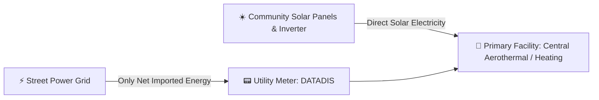
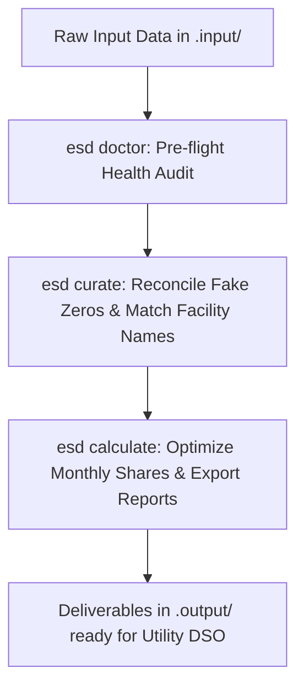

# 📘 Practical Guide to Electricity Share Distributor (`esd`)

> **Who this guide is for:** Homeowners associations (*comunidades de propietarios*), property managers (*administradores de fincas*), energy consultants, and building engineers who want to understand how collective solar distribution works across shared community facilities, without wading through dense mathematical formulas or legal jargon.

---

> [!IMPORTANT]
> ### 🛡️ Maintenance & Synchronization Harness
> **To developers and autonomous AI agents:**
> This document is the primary conceptual and operational guide for `electricity-share-distributor`.
> Whenever modifying the data ingestion schemas ([`src/ingestion/`](../src/ingestion)), curation logic ([`src/curation/`](../src/curation)), optimization solver ([`src/optimization/`](../src/optimization)), terminal presentation ([`src/presentation/views.py`](../src/presentation/views.py)), or file exporters ([`src/presentation/export.py`](../src/presentation/export.py)), you **MUST** update this guide (`GUIDE_EN.md`) and its Spanish counterpart (`GUIDE_ES.md`) in tandem.

---

## 1. 🎯 What is the Real Purpose of `esd`?

`electricity-share-distributor` (`esd`) is specifically designed to calculate optimal electricity distribution coefficients ($\beta_i$) for **shared common facilities within a single homeowners association (*comunidad de vecinos / propietarios*)** in Spain.

### 🚫 What `esd` is NOT:
- **`esd` is NOT meant to distribute energy to private residential dwellings or individual apartments.**
- It does not calculate domestic billing splits or private consumption shares between neighbors.

### 🏢 What `esd` IS:
When a residential community installs a shared rooftop photovoltaic (PV) system, the community uses the generated solar electricity to power its **own collective facilities and common services**, such as:
1. **Central Aerothermal / Heating & Hot Water (*Aerotermia / Calefacción Central / ACS*):** Typically the largest energy consumer in modern buildings.
2. **Swimming Pool & Community Hall (*Piscina y Sala Comunitaria*):** Filtration pumps, water treatment, lighting, and summer recreational demand.
3. **Underground Garages (*Garaje*):** Continuous ventilation systems, carbon monoxide extractors, and 24/7 lighting.
4. **Building Common Areas, Elevators & Staircases (*Ascensores, escaleras, alumbrado general*):** Hallway lighting, building intercoms, and elevator traction motors.

---

## 2. ⚖️ Why Does a Single Community Need Distribution Coefficients?

Even though all these shared services belong to the exact same *comunidad de propietarios*, Spanish electrical regulations treat each one as an **independent supply point with its own utility contract and electricity meter (CUPS)**.

Under **Real Decreto 244/2019** and **Orden TED/1247/2021**:
- The community must register a formal agreement with the electrical distribution company (DSO / *distribuidora*) specifying what percentage ($\beta_i$) of the solar energy generated each hour is allocated to each community meter.
- The coefficients across all participating community meters must add up to **strictly 100%** ($\sum \beta_i = 1.0$).
- Under standard monthly filing, these percentages remain constant throughout each calendar month. Alternatively, a 24-hour diurnal schedule can be filed under Orden TED/1247/2021.

### Why Naive Splitting Causes Huge Financial Loss:
It might seem simple to divide the solar power equally (e.g., $12.5\%$ to each of 8 community meters) or according to their annual bill. However, this causes severe financial waste:
- **The Seasonal Mismatch (Pool vs. Heating):** In January, the swimming pool filtration is shut down, while the central aerothermal heat pump works non-stop to heat the building. Assigning equal solar shares to the pool in winter spills valuable solar electricity into the street as surplus for pennies, while the community's heat pump is forced to purchase expensive peak grid electricity!
- **The Daily Mismatch (Lighting vs. Garage vs. Heat Pump):** Common area lighting uses very little baseline power (efficient LED bulbs and intercoms), while the central heat pump runs heavy compressor cycles during sunny midday hours. An equal split leaves lighting circuits with unused excess solar energy and starves the central heating.

**How `esd` Solves This:** The optimization engine analyzes hour-by-hour consumption curves across all community services and finds the exact mathematical coefficients that maximize self-consumption inside the community, drastically cutting the association's total electricity bill.

---

## 3. 🔍 The Curation Process: Solving the "Fake Zero" Riddle

Before calculating optimal shares, real-world community solar installations face a major measurement obstacle: **utility meters record "fake zeros" during sunny hours**.

### Why Utility Data Has Fake Zeros
In most community installations, the solar panels and inverter are physically wired right behind the meter of the primary facility (typically the central aerothermal heating or central services room):


```mermaid
graph LR
    Solar[☀️ Community Solar Panels & Inverter] -->|Direct Solar Electricity| PrimaryLoad[🏢 Primary Facility: Central Aerothermal / Heating]
    StreetGrid[⚡ Street Power Grid] -->|Only Net Imported Energy| UtilityMeter[📟 Utility Meter: DATADIS]
    UtilityMeter --> PrimaryLoad
```

1. **Inside the Community:** During sunny daylight hours, the aerothermal system runs directly on clean electricity generated by the rooftop panels.
2. **At the Utility Meter (DATADIS):** The utility meter only records electricity drawn from the street grid. Because solar power satisfies the demand on-site, the utility meter records **0.0 kWh**.
3. **The Trap:** If you optimize based solely on utility data, the community's primary facility looks completely inactive during the day! The algorithm would mistakenly strip solar shares away from the building's biggest consumer and reassign them to small meters (like staircase lighting) that cannot use the power.

### How `esd curate` Reconciles the Physical Reality
The curation engine ([`src/curation/`](../src/curation)) reconciles two separate data streams to recover true physical consumption:

1. **Utility Data (DATADIS):** Hourly consumption imported from the grid for each community meter.
2. **Solar Inverter Data:** The inverter's smart power sensor measures both solar production and the *total actual electrical demand* of the primary facility connected behind it.
3. **CUPS Descriptions ([`.input/cups/cups.json`](../.input/cups/cups.json)):** Maps 20-character CUPS codes to human-friendly facility names (e.g., `"Aerotermia"`, `"Piscina"`, `"Garaje"`, `"Alumbrado"`), and marks which one is the `"primary": true` connection point.

Whenever the utility meter reports zero (or artificially low power) while the inverter confirms that the equipment was actively running, `esd curate` **replaces the fake zero with the real load consumption**.

### The Curated Result (`.curated/curated.csv`)
The output is a single, clean, standardized table (using `;` as delimiter and `,` for decimals without thousands separators):
```csv
timestamp;generation;cups_id;use;consumption;temperature;cloud_cover
2026-05-01 12:00:00;12,5;ES0021000000000001AA;Aerotermia;8,5;21,4;12
2026-05-01 12:00:00;12,5;ES0021000000000002BB;Garaje;1,2;21,4;12
```
For the primary installation point, `esd` always adopts the higher consumption between the utility (DATADIS) and the solar inverter smart power sensor ($\max(C_{\text{DATADIS}}, C_{\text{inverter}})$). This guarantees full equipment demand is captured while avoiding fake zero underreporting. The CSV is ordered chronologically by timestamp (date/hour) and within each timestamp alphabetically by facility use. Furthermore, each hourly record includes local weather context (`temperature` in °C and `cloud_cover` percentage from 0 to 100%). If weather data is not already stored locally in `.input/weather/`, `esd curate` automatically queries Open-Meteo using the community's default location from `.input/cups/cups.json`.

---

## 4. 🧠 Core Heuristics Explained (Without Complex Math)

`esd` incorporates several practical rules to make community calculations robust and DSO-compliant:

### 1. Behind-the-Meter Fake Zero Detection & Maximum Load Adoption
For the community supply designated as primary, the solar inverter's smart power meter measures the total actual load demanded by the equipment. During solar generation hours, self-consumption behind the meter causes utility grid import readings (DATADIS) to drop to zero or artificially low levels. To capture the full true facility consumption while preventing measurement dropouts, `esd` always adopts $\max(C_{\text{DATADIS}}, C_{\text{inverter}})$, restoring the true load and recording the exact kWh recovered.

### 2. Forward-Looking Calendar Schedule (January to December)
Communities don't sign regulatory agreements to distribute energy in the past; they need a distribution schedule for an **upcoming operating year**. `esd` always structures its results as a clean 12-month calendar matrix running from January through December.

### 3. Complete Month Quality Threshold (The 90% Rule)
If the solar plant was commissioned midway through a month (e.g., on June 20th), optimizing a permanent monthly percentage based on just 10 days would produce an unfair, distorted result.
- `esd` verifies that each historical month has readings spanning from the start to the end of the month, covering **at least 90% of expected calendar days and hours**.
- If a month does not meet this threshold, the tool skips that month and displays a clean dash (`—`) rather than guessing with incomplete data.

### 4. Multi-Year Seasonal Pooling
Weather varies from year to year. A rainy May in 2025 followed by an exceptionally sunny May in 2026 shouldn't mislead the community agreement. When historical data is available for the same calendar month across multiple years, `esd` pools all hourly observations together. This blends out short-term weather anomalies and creates a balanced, representative profile for future years.

### 5. Exact 100% Rounding (The Hare-Niemeyer Method)
Electrical distribution companies (DSOs) reject regulatory share filings if the percentages do not sum to **strictly 100%**.
- Standard mathematical rounding often creates sums of 99% or 101% due to accumulated fractional decimals.
- `esd` uses the **Largest Remainder Method** (Hare-Niemeyer): it gives every community facility its integer share first, and then allocates the remaining decimal fractions to the facilities with the largest remainders until the sum is **strictly 100%** across any chosen precision (0, 1, or 2 decimal places).

### 6. Cloud-Resilient Hourly Profiles & Night Allocation
On cloudy or stormy days, solar production can drop to near zero. If elevator motors kick in during a momentary solar lull, calculating an instantaneous percentage would assign the elevator an absurdly high share (like 95%) that doesn't reflect typical habits.
- The 24-hour diurnal profile (`--hourly`) calculates consolidated hourly patterns across all observed days.
- It provides both the actual share (`share_pct`) and a cloud-resilient estimated share (`estimated_share_pct`) formatted for filing under Orden TED/1247/2021.
- **Night Hours with Exact Zero Generation:** In night hours where solar generation is exactly zero, 100% of the share is assigned to the primary installation CUPS (and 0% to other facilities). This avoids distributing meaningless fractions of zero energy across lighting or small circuits while maintaining an exact regulatory 100% sum.

---

## 5. 🚀 Practical Workflow & Commands

You can execute the entire pipeline with simple commands:


```mermaid
graph TD
    A[Raw Input Data in .input/] --> B[esd doctor: Pre-flight Health Audit]
    B --> C[esd curate: Reconcile Fake Zeros & Match Facility Names]
    C --> D[esd calculate: Optimize Monthly Shares & Export Reports]
    D --> E[Deliverables in .output/ ready for Utility DSO]
```

### Step 1: Check Data Health (`esd doctor`)
Scans all DATADIS CSV files and solar inverter Excel reports to detect gaps, inactive meters, and overlapping date ranges before doing any math:
```bash
esd doctor
```

### Step 2: Automatic or Manual Curation (`esd curate`)
Reconciles the fake zeros from the primary meter and outputs `.curated/curated.csv`:
```bash
esd curate
```
> [!TIP]
> **Automatic Curation:** You do not even need to run `esd curate` manually! When you run `esd calculate`, the tool checks if `.curated/curated.csv` exists. If it's missing, it automatically curates the data first.

### Step 3: Fetch Hourly Weather Data (`esd weather`)
Download historical hourly weather (temperature, cloud cover, WMO weather codes) from Open-Meteo into `.input/weather/{YYYY}_{lat}_{lon}_weather.csv`. Year is the only mandatory parameter: if coordinates are not provided on the CLI, `esd weather` automatically inspects `cups.json`, deduplicates repeated locations across facilities in the same building, and downloads each unique coordinate once:
```bash
# Automatically discover and download weather for all unique locations in cups.json
esd weather --year 2024

# Or specify custom coordinates explicitly
esd weather --year 2024 --latitude 40.4168 --longitude -3.7038
```

### Step 4: Calculate Optimal Community Shares (`esd calculate`)
Solves the optimal distribution schedule and displays clean 80-column terminal tables:
```bash
# Calculate full 12-month calendar schedule
esd calculate

# Filter to a specific year and month
esd calculate --year 2026 --month 5

# Include 24-hour diurnal profile and hourly time-series
esd calculate --hourly

# Set share percentage precision (0 = 53%, 1 = 52.8%, 2 = 52.86%)
esd calculate --precision 1
```

---

## 6. 📊 Deliverables & Official Documents (`.output/`)

Running `esd calculate` generates ready-to-use artifacts in `.output/`:

| File Name | Format | Practical Purpose |
| :--- | :--- | :--- |
| `*_esd_coefficients_matrix.csv` | CSV (`;` delimited) | Ready-to-import spreadsheet table formatted for official submission to the electrical utility distributor (DSO). |
| `*_esd_optimization_summary.md` | Markdown | Executive summary report including the community agreement annex ready for community board review. |
| `*_esd_coefficients.csv` | CSV (`;` delimited) | Detailed breakdown per CUPS: monthly self-consumed kWh, solar surplus, and remaining grid demand. |
| `*_esd_results.json` | JSON | Machine-readable data file for software integrations and community dashboards. |
| `*_esd_hourly_shares.csv` | CSV (`;` delimited) | Full hourly time-series recording consumption, generation, and actual vs. estimated shares, ordered first by date and then by use (alphabetically). |
| `*_esd_hourly_profile_matrix.csv` | CSV (`;` delimited) | 24-hour diurnal table for variable hourly coefficient filing under Spanish regulation (Orden TED/1247/2021). |

---

## 7. 🗺️ Code Map & Traceability Reference

For developers and autonomous agents navigating the codebase:

| Architecture Layer | Module | Key Classes / Functions | Responsibility |
| :--- | :--- | :--- | :--- |
| **CLI & Commands** | [`src/cli.py`](../src/cli.py) | `calculate_command`, `curate_command`, `weather_command`, `doctor_command` | Typer command routing, parameter validation, and user workflow dispatch. |
| **Configuration** | [`src/config.py`](../src/config.py) | `AppConfig`, `get_language`, `get_precision`, `get_weather_dir` | Settings persistence (`.esd_config.json`) and folder resolution. |
| **Localization** | [`src/i18n.py`](../src/i18n.py) | `t()`, `TRANSLATIONS` | English and Spanish dictionary lookups with string interpolation. |
| **Ingestion: Consumption** | [`src/ingestion/consumption.py`](../src/ingestion/consumption.py) | `DatadisConsumptionLoader` | DATADIS CSV discovery, encoding detection, and reading. |
| **Ingestion: Generation** | [`src/ingestion/generation.py`](../src/ingestion/generation.py) | `SolarGenerationLoader` | Solar inverter `.xlsx` report parsing (solar production and load demand). |
| **Ingestion: Weather** | [`src/ingestion/weather.py`](../src/ingestion/weather.py) | `OpenMeteoWeatherDownloader`, `WeatherLoader` | Open-Meteo Archive API downloader, WMO weather codes, and weather CSV ingestion. |
| **Ingestion: Audit** | [`src/ingestion/doctor.py`](../src/ingestion/doctor.py) | `DataDoctor`, `DoctorReport` | Pre-flight gap detection, inactive meter alerts, and date overlap verification. |
| **Curation & Reconciliation** | [`src/curation/`](../src/curation) | `DataCurator`, `CuratedDataset` | Fake-zero reconciliation, CUPS metadata lookup, and curated CSV export. |
| **Optimization: Models** | [`src/optimization/models.py`](../src/optimization/models.py) | `CoefficientsMatrix`, `HourlyProfileMatrix`, `OptimizationResult` | Matrix structures, diurnal profiles, and community metrics. |
| **Optimization: Solver** | [`src/optimization/engine.py`](../src/optimization/engine.py) | `DistributionOptimizer` | Linear programming solver, diurnal profile engine, baselines, and Hare-Niemeyer rounding. |
| **Presentation: Views** | [`src/presentation/views.py`](../src/presentation/views.py) | `render_coefficients_matrix_table`, `render_weather_result` | Rich terminal tables, adaptive 80-column formatting, and curation summaries. |
| **Presentation: Exports** | [`src/presentation/export.py`](../src/presentation/export.py) | `export_all`, `export_hourly_shares_csv` | Markdown summary generation, CSV spreadsheets, and JSON serialization. |
| **Security & Privacy** | [`src/security.py`](../src/security.py) | `CupsPrivacyChecker`, `scan_git_history` | GDPR enforcement and synthetic CUPS verification harness. |
