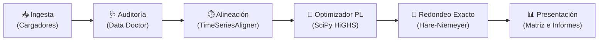

# 📘 Guía Técnica y de Funcionamiento (`esd`)

> **Público Objetivo:** Desarrolladores, ingenieros de datos y consultores energéticos con perfil técnico que desean comprender el funcionamiento interno de la herramienta sin necesidad de ser expertos en regulación eléctrica española o programación matemática lineal.

---

> [!IMPORTANT]
> ### 🛡️ Arnés de Mantenimiento para Desarrolladores y Agentes IA
> **Aviso para ingenieros, desarrolladores y agentes autónomos:**
> Este documento representa la referencia conceptual y operativa fundamental de `electricity-share-distributor`.
> Cada vez que se modifiquen los esquemas de ingesta ([`src/ingestion/`](file:///Users/marcos/workspace/repo/electricity-share-distributor/src/ingestion)), los modelos de programación lineal ([`src/optimization/`](file:///Users/marcos/workspace/repo/electricity-share-distributor/src/optimization)), las tablas en consola ([`src/presentation/views.py`](file:///Users/marcos/workspace/repo/electricity-share-distributor/src/presentation/views.py)) o los exportadores de archivos ([`src/presentation/export.py`](file:///Users/marcos/workspace/repo/electricity-share-distributor/src/presentation/export.py)), **DEBE** actualizarse esta guía (`GUIDE_ES.md`) y su equivalente en inglés (`GUIDE_EN.md`) para evitar discrepancias arquitectónicas o de documentación.

---

## 1. 🎯 Principios Básicos y Contexto Regulatorio

### El Reto del Autoconsumo Colectivo
En España, el **Real Decreto 244/2019** regula las condiciones administrativas, técnicas y económicas del autoconsumo de energía eléctrica. En una modalidad de *autoconsumo colectivo*, varios suministros (cada uno identificado por su código unívoco **CUPS**) comparten la electricidad generada por una instalación fotovoltaica común.

La normativa exige que los participantes formalicen un **acuerdo de reparto** con las siguientes reglas:
1. **Coeficientes Horarios de Reparto ($\beta_i$):** En cada hora $h$, el participante $i$ recibe una cuota de la generación horaria igual a $\beta_i \cdot G_h$.
2. **Restricción Mensual:** La regulación permite que los coeficientes varíen de un mes a otro ($\beta_{i, m}$), pero **dentro de un mismo mes natural, el coeficiente de cada participante debe ser único y fijo para todas las horas**.
3. **Restricción Presupuestaria:** La suma de los coeficientes de todos los participantes en un mes no puede superar el 100%:
   $$\sum_{i=1}^{N} \beta_{i, m} \le 1{,}0000 \quad (100{,}00\%)$$

### Por qué un Reparto Igualitario Desperdicia Energía Solar
Un reparto simple a partes iguales ($\beta_i = 1/N$, por ejemplo $11{,}1\%$ para 9 vecinos) o basado en el consumo bruto total provoca un desaprovechamiento crítico:
- **Curva Solar Diurna:** La energía solar fotovoltaica se produce exclusivamente durante el día (habitualmente de 08:00 a 20:00).
- **Desincronización de Hábitos:** Si a un vecino que trabaja fuera de casa o cuya vivienda está desocupada se le asigna un porcentaje fijo, su cuota solar no se autoconsume y se vierte a la red eléctrica como excedente. En España, la compensación de excedentes se liquida a precio de mercado mayorista (*pool*), notablemente inferior al precio minorista de compra de la electricidad.
- **Consecuencia:** Mientras ese vecino vierte energía a bajo precio, otro vecino con alto consumo diurno (teletrabajo, climatización, familias) se ve forzado a comprar energía cara de la red.
- **Misión de `esd`:** Encontrar matemáticamente los coeficientes mensuales óptimos ($\beta_{i, m}$) que **maximicen el autoconsumo colectivo directo** $\sum_i \min(C_{i, h}, \beta_{i, m} \cdot G_h)$, reteniendo la mayor cantidad posible de energía dentro de la comunidad.

---

## 2. 📥 Cómo Obtiene la Información la Herramienta

`esd` se alimenta de dos fuentes de datos complementarias situadas en el directorio `.input/`:

```
.input/
├── consumption/    # Archivos CSV de consumo horario de DATADIS (por CUPS)
└── generation/     # Libros Excel (.xlsx) de generación de Huawei FusionSolar
```

### 1. Curvas Horarias de Consumo de DATADIS
- **Origen:** [DATADIS](https://datadis.es), plataforma oficial y agregada de las distribuidoras eléctricas españolas.
- **Formato:** Archivos CSV con columnas `CUPS`, `Fecha` (`AAAA/MM/DD` o `DD/MM/AAAA`), `Hora` (1 a 24) y `Consumo_kWh`.
- **Tratamiento en Código ([`DatadisConsumptionLoader`](file:///Users/marcos/workspace/repo/electricity-share-distributor/src/ingestion/consumption.py)):**
  - Detección automática de codificación (`utf-8`, `iso-8859-1`, `windows-1252`).
  - Detección automática de delimitadores (`;`, `,` o `\t`).
  - Normalización de la convención horaria española (1 a 24) a marcas temporales estándar indexadas en cero (`00:00:00` a `23:00:00`).

### 2. Curvas de Generación Solar de Huawei FusionSolar
- **Origen:** Exportaciones del portal de gestión de inversores solares Huawei FusionSolar.
- **Formato:** Libros Excel (`.xlsx`) con mediciones temporales de producción solar.
- **Tratamiento en Código ([`HuaweiGenerationLoader`](file:///Users/marcos/workspace/repo/electricity-share-distributor/src/ingestion/generation.py)):**
  - Extracción de lecturas de columnas como `Rendimiento FV (kWh)` o `Rendimiento del inversor (kWh)`.
  - Normalización e indexación en marcas horarias estándar.

---

## 3. ⚙️ Cómo se Procesa la Información

El flujo de procesamiento consta de cinco fases sistemáticas:



### Fase 1: Auditoría y Diagnóstico de Salud ([`DataDoctor`](file:///Users/marcos/workspace/repo/electricity-share-distributor/src/ingestion/doctor.py))
Antes de cualquier cálculo, el motor de diagnóstico evalúa los datos brutos:
- **Detección de Huecos:** Identifica intervalos horarios ausentes y reporta su duración.
- **Detección de Inactividad:** Detecta suministros con $>90\%$ de lecturas a cero (contadores inactivos o segundas residencias).
- **Comprobación de Solape:** Localiza el rango de fechas en común entre la generación solar y los consumos para prevenir incoherencias temporales.

### Fase 2: Sincronización Temporal ([`TimeSeriesAligner`](file:///Users/marcos/workspace/repo/electricity-share-distributor/src/ingestion/aligner.py))
- **Alineación de Índices:** Transforma los consumos pivotando cada CUPS en una columna y cruzando los registros temporales con la serie de generación solar mediante intersección de índices de pandas.
- **Cambio de Hora Estacional (DST):** Gestiona los cambios de horario oficial en España (CET/CEST):
  - Transición de primavera (23 horas, se omite de 02:00 a 03:00).
  - Transición de otoño (25 horas, lectura duplicada de 02:00 a 03:00).
- **Segmentación Mensual:** Agrupa la serie continua en bloques mensuales (`AAAA-MM`) para su resolución independiente.

### Fase 3: Núcleo de Programación Lineal ([`DistributionOptimizer`](file:///Users/marcos/workspace/repo/electricity-share-distributor/src/optimization/engine.py))
Para cada mes $m$, el objetivo matemático es:
$$\max_{\beta_1, \dots, \beta_N} \sum_{i=1}^{N} \sum_{h \in \text{sol}} \min(C_{i, h}, \beta_i \cdot G_h) \quad \text{sujeto a} \quad \sum_{i=1}^{N} \beta_i \le 1{,}0, \; \beta_i \ge 0$$

#### La Transformación Epigráfica:
Dado que la función $\min(A, B)$ es no lineal, un algoritmo estándar no puede resolverla directamente. Se introduce una **variable auxiliar** $s_{i, h}$ que representa los kWh autoconsumidos por el CUPS $i$ en la hora solar $h$:
- **Límite Superior 1:** $s_{i, h} \le C_{i, h}$ (no se puede autoconsumir más de lo consumido).
- **Límite Superior 2:** $s_{i, h} \le \beta_i \cdot G_h \iff s_{i, h} - \beta_i \cdot G_h \le 0$ (no se puede autoconsumir más de la energía solar asignada).
- **Restricción Regulatoria:** $\sum_i \beta_i \le 1{,}0$.

El optimizador maximiza la suma de todas las variables $s_{i, h}$ empleando el solver **HiGHS de SciPy**, hallando la solución óptima global en cuestión de milisegundos.

### Fase 4: Redondeo Exacto al 100% ([`_round_betas`](file:///Users/marcos/workspace/repo/electricity-share-distributor/src/optimization/engine.py#L136))
El redondeo habitual en coma flotante (por ejemplo, `round(beta * 100, 2)`) suele producir sumas de $99{,}99\%$ o $100{,}01\%$. La distribuidora rechaza de plano cualquier acuerdo de reparto cuya suma mensual no sea exactamente igual o inferior al 100%.

Para garantizar la exactitud, `esd` implementa el **Método del Resto Mayor (Hare-Niemeyer)**:
1. Escala los coeficientes por $100 \times 10^p$ (donde $p$ es la precisión decimal configurada: 0, 1 o 2).
2. Obtiene la parte entera de cada cuota.
3. Calcula el déficit residual ($100 - \sum \lfloor \text{cuotas} \rfloor$).
4. Asigna las unidades restantes de forma ordenada a los participantes con mayores restos decimales.
5. **Resultado:** Se garantiza matemáticamente que la suma de cada columna sea **exactamente $100{,}00\%$** (o $100{,}0\%$ / $100\%$) en cualquier nivel de precisión.

### Fase 5: Comparativa de Eficiencia Frente a Estrategias Base
Para validar el ahorro, `esd` calcula simultáneamente dos escenarios de referencia:
- **`equal` ($1/N$):** Reparto simétrico e indiferenciado entre todos los contadores.
- **`consumption_share`:** Reparto proporcional al consumo bruto acumulado de cada miembro.

---

## 4. 📤 Salidas y Resultados Generados

### 1. La Matriz de Coeficientes de Reparto Mensuales
El resultado principal de `esd` es la **Matriz Regulatoria de Coeficientes de Reparto** ([`CoefficientsMatrix`](file:///Users/marcos/workspace/repo/electricity-share-distributor/src/optimization/models.py#L78)):
- **Filas (Eje Y):** Códigos CUPS de los suministros participantes.
- **Columnas (Eje X):** Meses naturales analizados y columna de **Media Anual Ponderada**.
- **Celdas:** Porcentaje de reparto sugerido ($\beta_i$) con la precisión configurada.
- **Fila TOTAL:** Acreditación de que cada columna suma exactamente el $100\%$.

```text
             📅 Matriz Sugerida de Coeficientes de Reparto (β_i %)
    Acuerdo regulatorio de reparto (RD 244/2019) • Suma mensual: 100%
╭────────────┬─────┬─────┬─────┬─────┬─────┬─────┬─────┬─────┬─────┬─────┬─────╮
│CUPS        │   12│   01│   02│   03│   04│   05│   06│   07│   08│   09│Media│
├────────────┼─────┼─────┼─────┼─────┼─────┼─────┼─────┼─────┼─────┼─────┼─────┤
│…00000001AA │ 1.2%│ 1.0%│ 1.2%│ 1.4%│ 1.9%│ 1.9%│ 1.4%│ 1.4%│ 1.6%│ 1.5%│ 1.5%│
│…00000002BB │ 1.0%│ 0.9%│ 1.2%│ 1.4%│ 2.0%│ 2.0%│ 1.4%│ 1.3%│ 1.6%│ 1.6%│ 1.6%│
│…00000003CC │ 1.3%│ 1.0%│ 1.3%│ 1.5%│ 2.2%│ 2.2%│ 1.4%│ 1.3%│ 1.7%│ 1.9%│ 1.7%│
│…00000004DD │ 9.1%│ 9.4%│10.4%│11.8%│23.8%│21.2%│14.2%│14.9%│18.6%│17.8%│16.6%│
│…00000005EE │ 1.5%│ 1.1%│ 1.4%│ 1.7%│ 2.5%│ 2.6%│ 1.6%│ 1.5%│ 1.8%│ 2.1%│ 1.9%│
│…00000006FF │ 0.0%│ 0.0%│ 0.0%│ 0.0%│ 0.0%│ 0.0%│ 0.0%│ 0.0%│ 0.0%│ 0.0%│ 0.0%│
│…00000007GG │ 1.2%│ 1.0%│ 1.1%│ 1.4%│ 2.0%│ 1.9%│ 1.3%│ 1.3%│ 1.7%│ 1.6%│ 1.5%│
│…00000008HH │ 0.0%│ 0.0%│ 0.1%│ 0.1%│ 0.1%│15.3%│20.4%│19.3%│28.1%│25.4%│13.6%│
│…00000009II │84.7%│85.6%│83.3%│80.7%│65.5%│52.9%│58.3%│59.0%│44.9%│48.1%│61.6%│
├────────────┼─────┼─────┼─────┼─────┼─────┼─────┼─────┼─────┼─────┼─────┼─────┤
│TOTAL       │ 100%│ 100%│ 100%│ 100%│ 100%│ 100%│ 100%│ 100%│ 100%│ 100%│ 100%│
╰────────────┴─────┴─────┴─────┴─────┴─────┴─────┴─────┴─────┴─────┴─────┴─────╯
```

### 2. Archivos e Informes Exportados (`.output/`)
La ejecución de `esd calculate` genera automáticamente cuatro entregables fechados:

| Archivo Generado | Formato | Finalidad |
| :--- | :--- | :--- |
| `*_esd_coefficients_matrix.csv` | CSV (delimitado por `;`) | Tabla en formato hoja de cálculo preparada para el anexo oficial a remitir a la distribuidora. |
| `*_esd_optimization_summary.md` | Markdown | Informe ejecutivo y anexo documental listo para la firma del acuerdo de reparto por la comunidad. |
| `*_esd_coefficients.csv` | CSV (delimitado por `;`) | Balance horario y mensual completo (kWh autoconsumidos, excedentes, demanda de red) por CUPS. |
| `*_esd_results.json` | JSON | Estructura de datos completa serializada para integraciones API o análisis posterior. |

---

## 5. 🗺️ Mapa de Código y Trazabilidad

Para inspeccionar o ampliar el código fuente, utilice la siguiente tabla de correspondencias:

| Capa Arquitectónica | Módulo | Clases / Funciones Clave | Responsabilidad |
| :--- | :--- | :--- | :--- |
| **CLI e Interfaz** | [`src/cli.py`](file:///Users/marcos/workspace/repo/electricity-share-distributor/src/cli.py) | `calculate_command`, `init_command`, `doctor_command` | Enrutamiento de comandos Typer, validación de parámetros y flujo general. |
| **Configuración** | [`src/config.py`](file:///Users/marcos/workspace/repo/electricity-share-distributor/src/config.py) | `AppConfig`, `get_language`, `get_precision` | Persistencia de ajustes en `.esd_config.json` y rutas de trabajo. |
| **Internacionalización** | [`src/i18n.py`](file:///Users/marcos/workspace/repo/electricity-share-distributor/src/i18n.py) | `t()`, `TRANSLATIONS` | Diccionarios bilingües inglés/español con interpolación de variables. |
| **Ingesta: Consumo** | [`src/ingestion/consumption.py`](file:///Users/marcos/workspace/repo/electricity-share-distributor/src/ingestion/consumption.py) | `DatadisConsumptionLoader` | Localización, lectura y normalización de archivos CSV de DATADIS. |
| **Ingesta: Generación** | [`src/ingestion/generation.py`](file:///Users/marcos/workspace/repo/electricity-share-distributor/src/ingestion/generation.py) | `HuaweiGenerationLoader` | Lectura de libros Excel `.xlsx` de Huawei FusionSolar. |
| **Ingesta: Diagnóstico** | [`src/ingestion/doctor.py`](file:///Users/marcos/workspace/repo/electricity-share-distributor/src/ingestion/doctor.py) | `DataDoctor`, `DoctorReport` | Detección previa de huecos, contadores inactivos y comprobación de solapes. |
| **Ingesta: Alineación** | [`src/ingestion/aligner.py`](file:///Users/marcos/workspace/repo/electricity-share-distributor/src/ingestion/aligner.py) | `TimeSeriesAligner` | Sincronización temporal horaria, imputación de nulos y cambios de hora DST. |
| **Optimización: Modelos** | [`src/optimization/models.py`](file:///Users/marcos/workspace/repo/electricity-share-distributor/src/optimization/models.py) | `CoefficientsMatrix`, `OptimizationResult` | Estructuras de datos matriciales y métricas de balances energéticos. |
| **Optimización: Solver** | [`src/optimization/engine.py`](file:///Users/marcos/workspace/repo/electricity-share-distributor/src/optimization/engine.py) | `DistributionOptimizer` | Formulación PL en SciPy HiGHS, comparativas y redondeo Hare-Niemeyer. |
| **Presentación: Vistas** | [`src/presentation/views.py`](file:///Users/marcos/workspace/repo/electricity-share-distributor/src/presentation/views.py) | `render_coefficients_matrix_table` | Tablas Rich para terminales de 80 columnas y barras gráficas de reparto. |
| **Presentación: Exportación** | [`src/presentation/export.py`](file:///Users/marcos/workspace/repo/electricity-share-distributor/src/presentation/export.py) | `export_all`, `export_coefficients_matrix_csv` | Generación de informes en Markdown, exportación a CSV y volcado en JSON. |
| **Seguridad y Privacidad** | [`src/security.py`](file:///Users/marcos/workspace/repo/electricity-share-distributor/src/security.py) | `CupsPrivacyChecker`, `scan_git_history` | Protección LOPD/RGPD y verificación estricta de CUPS sintéticos. |
